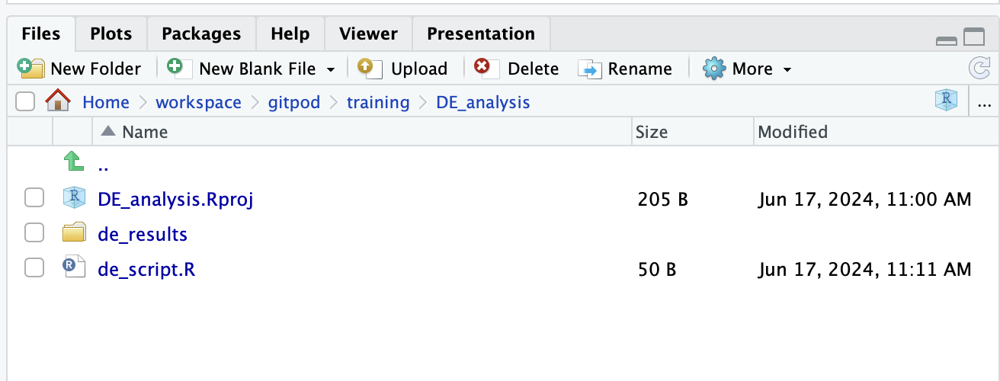

# Differential Analysis with DESeq2

In this section of the tutorial, we will guide you through the practical steps necessary to set up the RStudio environment and perform a differential expression analysis using DESeq2. Building on the theoretical foundations established earlier, we will now focus on the hands-on implementation of the DESeq2 workflow. We will cover all the necessary steps to prepare your RStudio environment, load the required libraries and data, and execute the DESeq2 analysis. By the end of this section, you will have a fully functional DESeq2 analysis pipeline set up in RStudio, ready to uncover the differentially expressed genes in your dataset.

## Launching the RStudio environment

Once the nf-core/rnaseq pipeline is terminated, the resulting data are stored in the folder results_star_salmon. No we can analyze the results by running DESeq2 on RStudio. First of all, we need to launch it by typing:

```bash
sudo rstudio-server start
```

A pop-up will appear and by clicking on "Open", we will be redirected to the RStudio login page. By inserting the username and the password reported below, we will be able to connect to RStudio.

```bash
Username: gitpod
Password: pass
```

Now we are quite ready to perform the differential expression analysis.


## Differential Expression Analysis

As in all analysis, firstly we need to create a new project:

1) Go to the [File] menu and select [New Project];

2) Select [New Directory], [New Project], name the new directory [/workspace/gitpod/training/DE_analysis/] and click on [Create Project];

3) The new project will be automatically opened in RStudio

We can check whether we are in the correct working directory with [getwd()]. The path ["/workspace/gitpod/training/DE_analysis/"] should appear on your console.

Then, to store our results in an organized way, we will create a folder named [de_results] using the "New Folder" button in the bottom right panel. We will save all our resulting tables and plots in this folder. Next, go to the [File] menu, select [New File], and then [R Script] to create a script editor in which we will save all commands required for the analysis. In the editor type:

```r
## Differential expression analysis with DESeq2
```

and save the file as [de_script.R]. From now on, each command described in the tutorial can be added to your script. The resulting working directory should look like this:



The analysis requires several R packages. To utilize them, we need to load the following libraries:

```r
# Loading libraries ----

# tidyverse: a collection of R packages for data manipulation, visualization and modeling
library("tidyverse")
# DESeq2: package for differential gene expression analysis
library("DESeq2")
# pheatmap: a package for creating heatmaps, which will be used to visualize the results
library("pheatmap")
# RColorBrewer: a package for creating color palettes, which will be used to customize the heatmaps
library("RColorBrewer")
# ggrepel: a package that provides a geom for ggplot2 to create repulsive text labels, which can be useful for avoiding overlapping labels in plots
library("ggrepel")
```

and the pre-computed DESeq2 object (dds) generated by the nfcore/rnaseq pipeline:

```r
# Import the dds obtained from nfcore/rnaseq ----

load("/workspace/gitpod/training/results_star_salmon/star_salmon/deseq2_qc/deseq2.dds.RData")
```

In DESEq2, the [dds] object is a central data structure that contains the following components: 
- countData: a matrix of raw count data, where each row represents a gene, and each column represents a sample.
- colData: a data frame containing information about the samples, such as the experimental design, treatment, and other relevant metadata.
- design: a formula specifying the experimental design utilized to estimate the dispersion and the log2foldchange.

All these components can be checked with specific command:

```r
# dds inspection ----

head(counts(dds)) # to check the raw counts
colData(dds) # to check the sample info
design(dds) # to check the design formula
```

The inspection of the dds revealed that the colData and the design must be re-organized prior to the analysis. Whit the following command we will rename the column of the colData, we will ensure that the rownames of the metadata are present in the same order as the column names and we reconstruct the colData. Notice that with this operation we also eliminate the sizeFactors already estimated by the [nfcore DESeq2 module](https://github.com/nf-core/rnaseq/blob/master/modules/local/deseq2_qc/main.nf) 

```r
# Creation of metadata starting from the dds colData ----

metadata <- DataFrame(
    sample = colData(dds)$sample,
    condition = colData(dds)$Group1,
    replica = colData(dds)$Group2
)

# Assign names to rows of metadata ----

rownames(metadata) <- colnames(counts(dds))

# Fill the dds colData with the generated metadata ---

colData(dds) <- metadata
```

To avoid errors in DESeq2 is essential to check that sample names match between the colData and the countData, and that the sample are in the correct order:

```r
# Check that sample names match in both files ----

all(colnames(dds$counts) %in% rownames(metadata)) # Must be TRUE
all(colnames(dds$counts) == rownames(metadata)) # Must be TRUE
```

Now that everything is setted up, we can proceed to generate a new DESeq2 object with the corrected metadata and the right design:

```r
# Creation of a new dds ----

dds_new  <- DESeqDataSet(dds, design = ~ condition)

# dds inspection ----

head(counts(dds_new)) # to check the raw counts
colData(dds_new) # to check the sample info
design(dds_new) # to check the design formula
```

Analyzing the structure of the newly created dds, we can observe the differences:


Before running the differebt steps of the analysis, a good practice consists in pre-filtering the genes to remove those with very low counts. This is useful tp reduce noie, improving computional efficiency and enhancing interpretability. In general it is reasonable to keep only genes with a counts of at least 10 for a minimal number of samples of 3:

```r
# Pre-filtering ---

smallestGroupSize <- 3 # minimal number of samples = 3

keep <- rowSums(counts(dds_new) >= 10) >= smallestGroupSize # genes with a sum counts of at least 10 in 3 samples

dds_filtered <- dds_new[keep,] # keep only the genes that pass the threshold
```

The next step in the DESeq2 workflow is to perform quality control (QC) analysis on our data. This analysis is crucial for identifying potential issues or biases and ensuring the data is suitable for downstream analysis. For QC analysis, it is useful to work with transformed versions of the count data because raw count data are not suitable for these methods due to their discrete nature and the fact that their variance tends to increase with the mean. To address this, DESeq2 provides two types of transformations: variance stabilizing transformations (vst) and regularized logarithm (rlog). These transformations help to remove the dependence of the variance on the mean, making the data more suitable for visualization and exploratory analysis. While, the rlog is more robust to outliers and extreme values, vst is computationally faster and so preferred for larger dataset.
It's important to remember that these transformations are used for visualization purposes, while DESeq2 itself operates on raw counts for differential expression analysis.

```r
# Transform normalized counts for data viz ----
# A user can choose among vst and rlog. In this tutorial we will work with rlog transformed data.

rld <- rlog(dds_filtering, blind = TRUE)
```

The rlog and the vst transformations have an argument, [blind] that can be set to:
- TRUE (default): useful for QC analysis because it re-estimates the dispersion, allowing for comparison of samples in an unbiased manner with respect to experimental conditions;
- FALSE: the function utilizes the already estimated dispersion, generally applied when differences in counts are expected to be due to the experimental design.

Next, we perform Principal Component Analysis (PCA) to visualize the data. DESeq2 provides a built-in function, [plotPCA], which uses [ggplot2](https://ggplot2.tidyverse.org) for visualization, taking the [rld] object as input.
We will use the [condition] information from our metadata to plot the PCA, since the [treatment] is the principal condition of interest in our metadata: 

```r
# Plot PCA ----

plotPCA(rld, intgroup = "condition")
```

The second essential step in QC analysis is hierarchical clustering. Although DESeq2 does not have a built-in function for this analysis, we can use the [pheatmap()] function from the [pheatmap] package.
First, we need to install the [pheatmap] package:

```r
# Install the pheatmap package ----

install.packages("pheatmap")
```

Next, we will extract the matrix of rlog-transformed counts from the rld object (pheatmap input), compute pairwise correlations and plot the heatmap:

```r
# Plot sample to sample distance (hierarchical clustering) ----

# Extract the matrix of rlog-transformed counts from the rld object

sampleDists <- dist(t(assay(rld)))  # Calculate pairwise distances between samples using the dist() function with Euclidean distance as the default method. By transposing the matrix with t(), we ensure that samples become rows and genes become columns, so that the dist function computes pairwise distances between samples.

sampleDistMatrix <- as.matrix(sampleDists)  # Convert distances to a matrix

# Set the row and column names of the distance matrix

rownames(sampleDistMatrix) <- paste(rld$condition, rld$replica, sep = "_")
colnames(sampleDistMatrix) <- paste(rld$condition, rld$replica, sep = "_")

# Define a color palette for the heatmap

colors <- colorRampPalette(rev(brewer.pal(9, "Greens")))(255) # function from RColorBrewer package

# Create the heatmap

pheatmap(sampleDistMatrix, 
        clustering_distance_rows = sampleDists, 
        clustering_distance_cols = sampleDists, 
        col = colors, 
        fontsize_col = 8, 
        fontsize_row = 8)
```

Now, it is time to run the differential expression analysis with the [DESeq] function.

```r
# Run the DESeq2 analysis ----

dds_final <- DESeq(dds_filtered)
```

The [DESeq] function is a high-level wrapper that simplifies the process of differential expression analysis by combining multiple steps into a single function call:


This makes the workflow more user-friendly and ensures that all necessary preprocessing and statistical steps are executed in the correct order. The key functions that [DESeq] calls include: 
- estimateSizeFactors: to normalize the count data;
- estimateDispersion: to estimate the dispersion;
- nbinomWaldTest: to perform differential expression test.

The individual functions can be carried out also singularly as shown below:

```r
# Differential expression analysis step-by-step ---

dds <- estimateSizeFactors(dds)
dds <- estimateDispersions(dds)
dds <- nbinomWaldTest(dds)
```

The normalized counts stored in the [dds] can be inspected with the [counts()] function and saved in our results folder:

```r
# Inspect the normalized counts ----

normalized_counts <- counts(dds_final, normalized = TRUE)

# Save normalized counts ----

write.csv(normalized_counts, file = "de_results/normalized_counts.csv")
```

The [results()] function in DESeq2 is used to extract the results of the differential expression analysis. This function takes the [dds] object as input and returns a DataFrame containing the results of the analysis:

- baseMean: the average expression level of the gene across all samples;
- log2FoldChange: the log2 fold change of the gene between the condition of interest and the reference level;
- lfcSE: the standard error of the log2 fold change;
- stat: the Wald statistic, which is used to calculate the p-value;
- pvalue: the p-value associated with the Wald test, which indicates the probability of observing the log2 fold change by chance;
- padj: the adjusted p-value, which takes into account multiple testing corrections;

By default, the [results()] function returns the results for all genes in the analysis with an adjusted p-value below a specific FDR cutoff, set by the default to 0.1. This threshold can be modified with the parameter [alpha]. The [results()] function can also be customized to extract specific columns or rows of interest, and can also be used to filter the results based on certain criteria, such as a minimum log2 fold change or a maximum adjusted p-value or to set a specific contrast. The [contrast] argument in the [results()] function is used to specify the contrast of interest for which the results should be extracted. A contrast is a specific comparison between two or more levels of a factor, such as the comparison between the treatment and control groups. The order of the contrast names determines the direction of the fold change that is reported in the results. Specifically, the first level of the contrast is the condition of interest, and the second level is the reference level. Notice that in the tutorial the contrast is already setted.

```r
# Extract results table from the dds object ----

res <- results(dds)

head(res) # Visualize the results

summary(res) # Summarize the results showing the number of tested genes (genes with non-zero total read count), the genes up- and down-regulated at the selected threshold (alpha) and the number of genes excluded by the muòtiple testing due to a low mean count 

resultsNames(dds) # DESeq2 function to extract the name of the contrast

#contrast <- c("name_of_design_formula", "condition_of_interest", "reference_level") # Command to set the contrast, if necessary

# Save the results table ----

write.csv(res, file = "de_results/de_result_table.csv")
```

In the "Experimental Design" section, we emphasized the importance of estimating the log2 fold change threshold using a statistical power calculation, rather than selecting it arbitrarily. This approach ensures that the chosen threshold is statistically appropriate and tailored to the specifics of the experiment. However, since we are working with simulated data for demonstration purposes, we will use a padj (adjusted p-value) threshold of 0.05 and consider genes with a log2 fold change greater than 1 or less than -1 as differentially expressed.

```r
# Extract significant DE genes from the results ----

resSig <- subset(res, padj < 0.05 & abs(log2FoldChange) > 1) # Filter the results to include only significantly differentially expressed genes with an adjusted p-value (padj) less than 0.05 and a log2foldchange greater than 1 or less than -1

resSig$gene <- rownames(resSig) # Add a new column to the results with the gene names

resSig <- as_tibble(resSig) %>% relocate(gene, .before = baseMean) # Convert the results to a tibble for easier manipulation and relocate the 'Gene' column to be the first column

resSig <- resSig[order(resSig$padj),] # Order the significant genes by their adjusted p-value (padj) in ascending order

resSig # Display the final results table of significant genes

# Save the significant DE genes ----

write.csv(res, file = "de_results/sig_de_genes.csv")
```

Now that we have obtained the results of the differential expression analysis, it's time to visualize the data to gain a deeper understanding of the biological processes that are affected by the experimental conditions. Visualization is a crucial step in RNA-seq analysis, as it allows us to identify patterns and trends in the data that may not be immediately apparent from the numerical results. In the following sections, we will explore different types of plots that are commonly used to visualize the results of RNA-seq analysis, including:

- MA plot: it is a type of scatter plot that is commonly used to visualize the results of differential expression analysis for all the samples. The plot displays the log2 fold change on the y-axis and the mean of the normalized counts on the x-axis. This allows for the visualization of the relationship between the magnitude of the fold change and the mean expression level of the genes. Genes that are highly differentially expressed will appear farthest from the horizontal axis, while genes with low expression levels will appear closer to the axis. MA plots are useful for identifying genes that are both highly expressed and highly differentially expressed between two conditions.

```r
# MA plot ----

plotMA(res, ylim = c(-2,2))
```
 
- counts plot: it plots the normalized counts for a single gene across the different conditions in your experiment. It’s particularly useful for visualizing the expression levels of specific genes of interest and comparing them across sample groups.

```r
# Plot a specific gene in this case ENSG00000142192, a DE gene ----

plotCounts(dds, gene = "ENSG00000142192")
```

- volcano plot: it is a type of scatter plot that displays the log2 fold change on the x-axis and the log transformed padj on the y-axis. This allows for the visualization of both the magnitude and significance of the changes in gene expression between two conditions. Genes that are highly differentially expressed (i.e., have a large log2 fold change) and are statistically significant (i.e., have a low p-value) will appear in the top-left or top-right corners of the plot, making it easy to identify the most biologically meaningful changes.

```r
# Volcano plot ----

# Convert the results to a tibble and add a column indicating differential expression status

res_tb <- as_tibble(res) %>% 
  mutate(diffexpressed = case_when(
    log2FoldChange > 1 & padj < 0.05 ~ 'upregulated', 
    log2FoldChange < -1 & padj < 0.05 ~ 'downregulated',
    TRUE ~ 'not_de'
  ))

# Add a new column with gene names

res_tb$gene <- rownames(res) 

# Relocate the 'gene' column to be the first column

res_tb <-  res_tb %>% 
  relocate(gene, .before = baseMean)

# Order the table by adjusted p-value (padj) and add a new column for gene labels

res_tb <- res_tb %>% arrange(padj) %>% mutate(genelabels = "")

# Label the top 5 most significant genes

res_tb$genelabels[1:5] <- res_tb$gene[1:5]

# Create a volcano plot using ggplot2

ggplot(data = res_tb, aes(x = log2FoldChange, y = -log10(padj), col = diffexpressed)) + 
  geom_point(size = 0.6) + 
  geom_text_repel(aes(label = genelabels), size = 2.5, max.overlaps = Inf) +
  ggtitle("DE genes treatment versus control") + 
  geom_vline(xintercept = c(-1, 1), col = "black", linetype = 'dashed', linewidth = 0.2) +
  geom_hline(yintercept = -log10(0.05), col = "black", linetype = 'dashed', linewidth = 0.2) +
  theme(plot.title = element_text(size = rel(1.25), hjust = 0.5),
        axis.title = element_text(size = rel(1))) +
  scale_color_manual(values = c("upregulated" = "red", 
                                "downregulated" = "blue", 
                                "not_de" = "grey")) +
  labs(color = 'DE genes') +
  xlim(-3,5)

```

heatmap: plot of the normalized counts for all the significant genes obtained with the [pheatmap()] function. The heatmap provides insights into genes and sample relationships that may not be apparent from individual gene plots alone. 

```r
# Heatmap ----

# Extract significant genes from the result object
significant_genes <- resSig$gene

# Extract normalized counts for significant genes from the normalized_counts matrix
significant_counts <- normalized_counts[significant_genes, ]

# Create a heatmap using pheatmap
pheatmap(significant_counts, 
         cluster_rows = TRUE,
         fontsize = 8,
         scale = "row",
         fontsize_row = 8,
         height = 10)
```