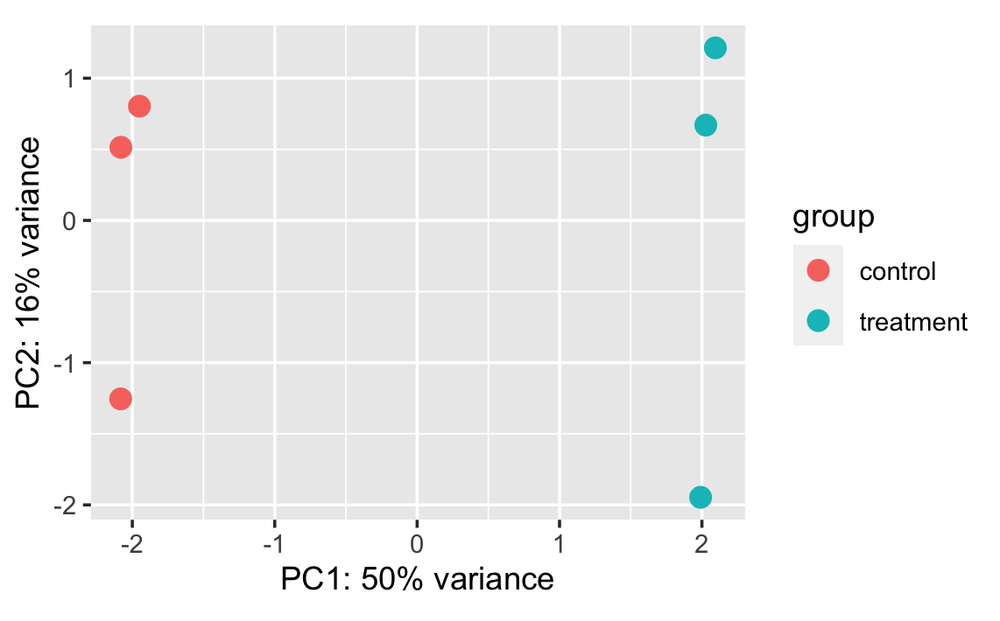
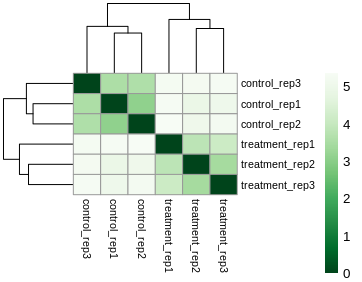
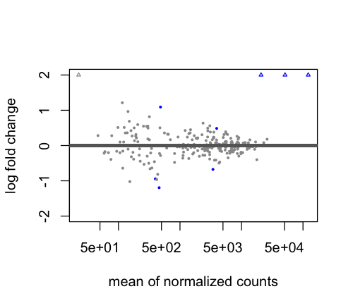
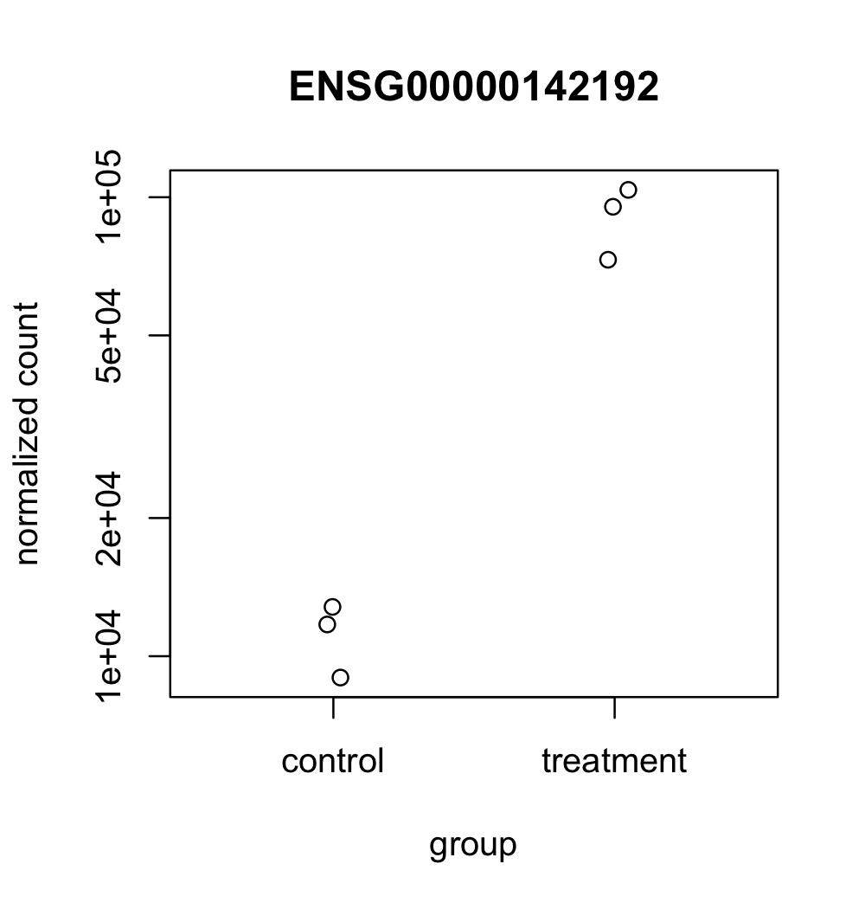
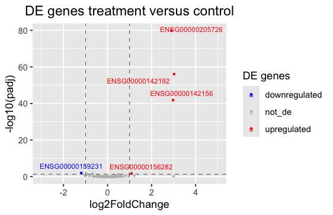
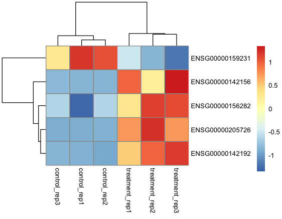

# Interpretation

Once the differential expression genes have been identified, the next crucial step is to interpret the results. This involves examining the tables and plots generated during the analysis to understand the biological implications of the data. In this part of the tutorial, we will delve into the results by discussing the significant genes identified, their expression patterns, and the visual representations of these findings. We will explore various tables and plots, such as volcano plots, MA plots, and heatmaps, to gain insights into the underlying biological processes and validate the reliability of our results.

The first plot we will examine is the Principal Component Analysis (PCA) plot. Since we're working with simulated data, our metadata is relatively simple, consisting of just three variables: sample, condition, and replica. In a typical RNA-seq experiment, however, metadata can be complex and encompass a wide range of variables that could contribute to sample variation, such as sex, age and developmental stage. 



By plotting the PCA on the PC1 and PC2 axes, using [condition] as the main variable of interest, we can quickly identify the primary source of variation in our data. By accounting for this variation in our design model, we should be able to detect more differentially expressed genes related to [condition]. When working with real data, it's often useful to plot the data using different variables to explore how much variation is explained by the first two PCs. Depending on the results, it may be informative to examine variation on additional PC axes, such as PC3 and PC4, to gain a more comprehensive understanding of the data.

Next, we will examine the hierarchical clustering plot to explore the relationships between samples based on their gene expression profiles. The heatmap is organized such that samples with similar expression profiles are close to each other, allowing us to identify patterns and structures in the data.



We can observe a high degree of correlation in the plot. Remember that to create this plot, we utilized the [dist()] function, so in the legend on the right, a value of 0 corresponds to high correlation, while a value of 5 corresponds to very low correlation. Similar to PCA, we can see that samples tend to cluster together according to [condition].

Overall, the integration of these plots suggests that we are working with high-quality data and can confidently proceed to the differential expression analysis.

From this point, we will examine plots that are generated after running the differential expression analysis. These plots are not quality control (QC) plots, but rather plots that help us interpret the results of the differential expression analysis. 
After running the [results()] function, a good way to start to have an idea about the results of our differential expression analysis is to look at the MA plot. 



By default, genes are coloured in blue if the padj is less than 0.1 and the log2foldchange greater than or less than 0. Genes that fall outside the plotting region are represented as open triangles. Note that we have not yet applied a filter to select only significant, which we define as those with a padj value less than 0.5 and a log2 fold change of at least 1 or -1.

After filtering our genes of interest according to our threshold, let's have a look to our significatnt genes

```bash
log2 fold change (MLE): condition treatment vs control 
Wald test p-value: condition treatment vs control 
DataFrame with 5 rows and 6 columns
                  baseMean log2FoldChange     lfcSE      stat      pvalue        padj
                 <numeric>      <numeric> <numeric> <numeric>   <numeric>   <numeric>
ENSG00000205726 121443.148        2.89349  0.158852  18.21500 3.92402e-74 9.18221e-72
ENSG00000142192  50948.182        3.02171  0.200662  15.05871 3.02628e-51 3.54075e-49
ENSG00000142156  20743.964        2.97325  0.227338  13.07853 4.36799e-39 3.40703e-37
ENSG00000159231    458.246       -1.19777  0.297935  -4.02023 5.81421e-05 3.40131e-03
ENSG00000156282    481.094        1.09039  0.291188   3.74462 1.80664e-04 8.45506e-03
```

After the identification of DE genes, it's informative to visualize the expression of specific genes of interest. Using the [plotCounts()] function directly on the [dds] object allows us to examine individual gene expression profiles without accessing the full [res] object.



In our example, post-treatment, we observe a significant increase in the expression of the ENSG00000142192 gene, highlighting its responsiveness to the experimental conditions.

To gain a comprehensive overview of the transcriptional profile, the volcano plot represents a highly informative tool.



The treatment induced differential expression in five genes, with one downregulated and four upregulated. This plot visually represents the numerical results reported in the table above.

By extracting the normalized counts of all genes and subsetting only significant de genes, we can plot the heatmap



## Enrichment Analysis (ORA)


## Conclusions