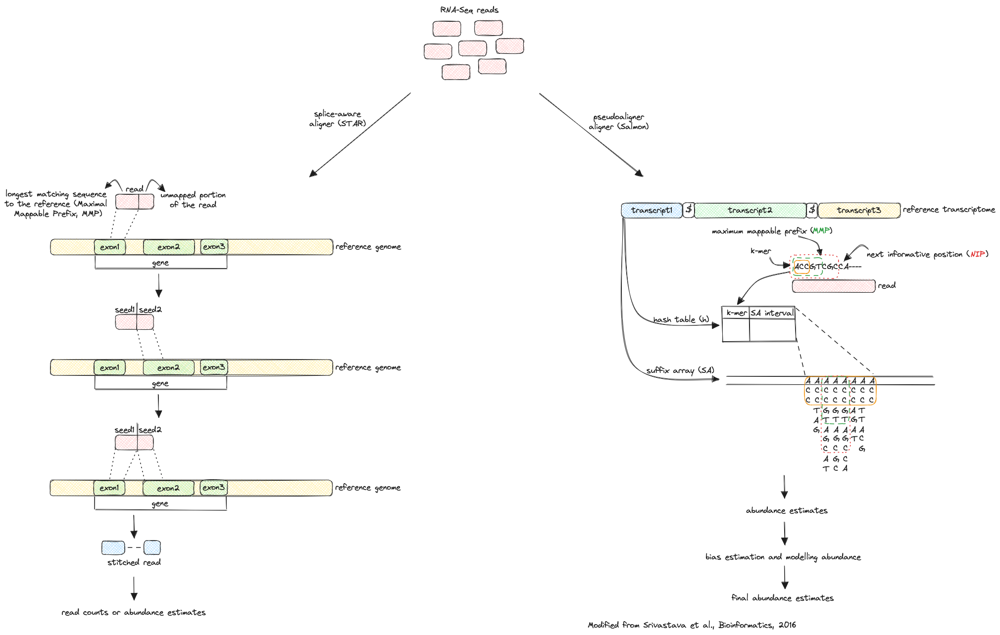

# RNAseq Analysis

Before we dive into the nf-core pipeline used for the analysis of RNA-sequencing data, it's worth looking at some theoretical aspects of RNA-seq.

## Overview

Given the central role of the RNA in a variety of cellular and molecular functions, nowadays, RNA-seq became one of the most powerful and important approaches to measure the presence and the levels of RNA species in biological samples. The technique is based on next generation sequencing (NGS) technologies, and it is now considered as the gold standard in the transcriptomic field.

After RNA extraction and reverse transcription into complementary DNA (cDNA), the biological material is sequenced with the generation of NGS “reads”, sequences corresponding to the RNA captured and sequenced in a specific cell, tissue or organ at a given time. Sequencing data are then bioinformatically processed with a typical workflow summarized in the diagram below:

In the scheme we can identify three different key phases in the workflow: pre-processing, alignment (or pseudoalignment) and quantification and finally differential expression analysis. In the pre-processing step, the raw reads are handled to remove adapters and contaminants and the quality is checked. Then, reads are mapped to a genome reference and the abundance of transcripts or genes is estimated. The workflow can also follow an additional route based on a pseudoalignment and quantification, reducing the amount of time required for the analysis. Finally, differentially expressed genes or transcripts are identified with statistical tests, annotated and visualized. Depending upon the user’s needs, the workflow can include additional downstream analysis such as functional enrichment analysis (to identify enriched biological pathways or processes), coexpression analysis (to identify hub genes and their relationships) and integration with other omics data (to produce a comprehensive understanding of biological systems).

## Pre-processing 

The pre-processing of sequencing reads from RNA-seq data is a critical step to ensure the quality and accuracy of downstream analysis. The raw reads obtained from the sequencer are stored as [FASTQ] files (https://en.wikipedia.org/wiki/FASTQ_format). The starting data were initially processed to evaluate the quality and identify potential issues such as sequencing errors, adapter contamination or low-quality bases. Reads with low-quality bases or overall poor sequencing quality are removed.
Then, the presence of adapters (short DNA sequences ligated to the ends of DNA fragments during library preparation) is tested through the comparison of each read to a set of known adapter sequences or by using algorithms that detect adapter-like sequences and removed in a process known as “read trimming”. Finally, reads containing contaminants (genomic DNA and/or rRNA) are filtered out and the quality of filtered reads was checked again to ensure their suitability to undergo the downstream processing. 

## Alignment (or pseudoalignment) and quantification

In the RNA-seq workflow, the alignment step refers to the process of mapping sequencing reads to a reference genome or transcriptome with the goal of determining the position and orientation of each read relative to the reference sequence and allowing the subsequent gene expression quantification.

Errors, gaps or poor sequence quality regions as well as insertions/deletions (INDELs), duplicated and repetitive regions make this step challenging. Addressing these issues during the alignment step, by choosing a high-quality reference and an appropriate aligner, is essential for obtaining accurate and reliable results. A crucial component in the RNA-seq workflow is the [annotation](https://www.ncbi.nlm.nih.gov/genbank/genomes_gff) file, either in form of General Feature Format file (GFF) or in form of Gene Transfer Format file (GTF). These file formats contain key information about the location and structure of genes and transcripts and are essential for both mapping sequencing reads accurately during the alignment step and to quantify genes expression in the quantification step. Additionally, RNA-seq data often include reads that span exon-exon junctions and the annotation files provide information about splice junctions allowing the inference of different isoforms.

The aligment and quantification steps can follow two different steps according to user preferences:
- alignment and quantification;
- pseudoalignment and quantification.
In the context of RNA-seq analysis the alignmnet phase is often performed with splice-aware aligners that are utilized to take in account the splicing process. In addition to aligning reads across known splice junctions, splice-aware aligners also aim to detect novel splice junctions and alternative splicing events. Splice-aware aligners are optimized for speed and memory efficiency to handle the large volumes of RNA-seq data generated in modern sequencing experiments. They employ sophisticated algorithms and various optimization techniques, such as indexing the reference genome, parallel processing and memory-mapping, to achieve fast and scalable alignment. Popular splice-aware aligners include [STAR](https://github.com/alexdobin/STAR) and [HISAT2](https://github.com/DaehwanKimLab/hisat2). The following step is typically the quantification, which involves estimating the abundance of genes or transcripts in the samples. The workflow involves the generation of a index from the reference genome and the annotation file (GFF/GTF). This index will be used by the quantification software to map aligned reads to annotated transcripts and quantify their expression levels. The resulting expression counts or abundance estimates represent the number of reads assigned to each transcript in the samples. Several tools are available to perform the quantification step such as [featureCounts](https://subread.sourceforge.net/featureCounts.html), [HTSeq](https://htseq.readthedocs.io), [Salmon](http://combine-lab.github.io/salmon) and [RSEM](http://deweylab.github.io/RSEM).
The alignment and the quantification steps can be also performed with lightweight alignment tools, which include [Kallisto](https://pachterlab.github.io/kallisto/about.html), [Sailfish](http://www.cs.cmu.edu/~ckingsf/software/sailfish) and Salmon. These tools avoid a base-to-base alignment of reads providing quantification estimates faster than the classical splice-aware algorithms but with a high accuracy. The resulting estimates are commonly referred to as “pseudocounts” or “abundance estimates”, that can be later utilized for downstream analysis.
An example showing the differences between a splice-aware aligner (STAR) and a pseudoaligner (Salmon) are represented in the scheme below:

